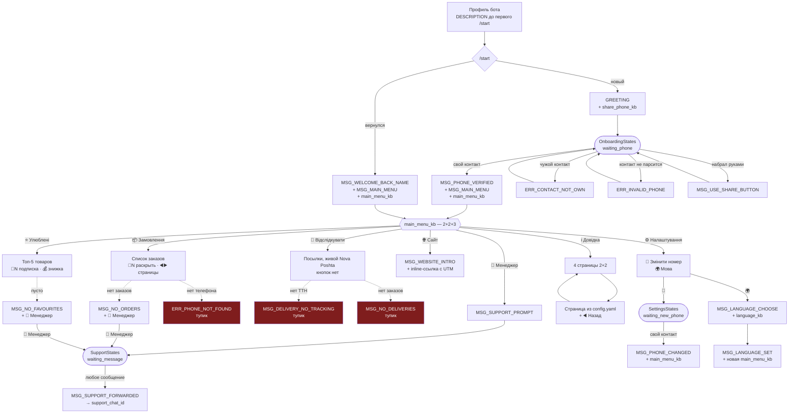

# Карта экранов и аудит UX

Снимок построен чтением кода 2026-08-19, ветка `master`, коммит `7cdbf6b`.
Всё, что ниже, — то, что реально рисует код, а не то, что планировалось.
Расхождения с `docs/current-state.md` (коммит `27cd73f`) ожидаемы.

Тексты кнопок приведены как в `core/texts.py` — украинскими, потому что
это ровно те строки, которые видит клиент.

---

## 1. Два способа навигации, и почему их два

В боте не одна навигация, а две, и они не взаимозаменяемы.

**Reply-клавиатура под полем ввода** (`main_menu_kb`, `bot/keyboards.py:43`) —
корневое меню. Она существует не ради вкуса: квадратная иконка-переключатель в
строке ввода рисуется клиентом **только пока reply-клавиатура есть**. Никакой
API её не создаёт. Нажатие такой кнопки — обычное текстовое сообщение клиента,
поэтому раздел открывается **новым** сообщением: выше нечего редактировать.

**Inline-кнопки внутри раздела** — один живой экран. Всё, что нажато внутри
раздела, перерисовывает **то же самое** сообщение (`render`,
`bot/screen.py:25`), с откатом на отправку нового, когда Telegram отказывает в
правке. Поэтому в разделе нет кнопки «Назад»: меню и так на экране.

Отсюда жёсткое ограничение вёрстки: **inline-клавиатура шириной с пузырь
сообщения**, под которым висит. Под коротким текстом — не больше двух кнопок в
ряд; три и больше безопасны только с двухсимвольными подписями (`🔎 1`, `🔔 2`).
Reply-клавиатура шириной с экран, поэтому там 2+2+3 проходит.

---

## 2. Карта

---

## 3. Инвентарь экранов

### Онбординг

| Экран | Где | Клавиатура | Выходы |
|---|---|---|---|
| Профиль до `/start` | `bot/profile.py:41` `DESCRIPTION` | — | «Почати» |
| Приветствие нового | `bot/handlers/common.py:81` | `share_phone_kb` | контакт |
| Приветствие вернувшегося | `common.py:71` | `main_menu_kb` | меню |
| Предложение языка | `common.py:31` | `language_kb` | uk / en |
| Чужой контакт | `onboarding.py:75` | `share_phone_kb` | назад к шарингу |
| Контакт не парсится | `onboarding.py:81` | `share_phone_kb` | назад к шарингу |
| Набрал руками | `onboarding.py:98` | `share_phone_kb` | назад к шарингу |
| Номер принят | `onboarding.py:58` | `main_menu_kb` | меню |

Телефон принимается **только** через `request_contact` со сверкой
`contact.user_id == from_user.id` (`core/domain/phone.py`, тип `VerifiedPhone`).
Это не UX-решение, а граница безопасности: набранный руками номер открыл бы
чужие заказы и адрес доставки.

### Разделы

| Ключ меню | Экран | Где | Inline-кнопки |
|---|---|---|---|
| `📦 Замовлення` | список, 5 на страницу, ⭐ на свежайшем | `orders.py:364` | `🔎 N` / `🔼 N`, `◀️ Новіші`, `Старіші ▶️` |
| `🚚 Відслідкувати` | посылки с ТТН, живой Nova Poshta | `delivery.py:78` | **нет** |
| `⭐ Улюблені` | топ-5 по числу заказов | `orders.py:406` | `🔔 N` / `🔕 N`, `💰 Хочу знижку` |
| `💬 Менеджер` | приглашение написать | `menu.py:87` | — |
| `🌐 Сайт` | ссылка с UTM | `menu.py:120` | url-кнопка |
| `ℹ️ Довідка` | 4 страницы из `config.yaml` | `menu.py:95` | `Про нас`/`Контакти`/`Оплата`/`Доставка`, внутри `◀️ Назад` |
| `⚙️ Налаштування` | телефон и язык | `menu.py:102` | `📱 Змінити номер`, `🌍 Мова` |

Пороги, зашитые в списки, и почему они такие
(`bot/handlers/orders.py:36-51`):

| Число | Что | Обоснование в коде |
|---|---|---|
| 5 | заказов на страницу | у 92% клиентов вся история на одной странице без кнопок |
| 4 | товаров показать целиком | 78% заказов укладываются (замерено на 43 374 заказах) |
| 2 | товара в свёрнутом виде | остальное — «…та інші (N)» |
| 5 | товаров в избранном | `favourite_products(limit=5)` |
| 300 с | TTL кеша заказов | всплеск после рассылки не бьёт по CRM |
| 3800 | символов на сообщение | запас до лимита Telegram 4096 |

### Что бот шлёт сам

| Повод | Текст | Тише ночью | Эффект |
|---|---|---|---|
| Товар вернулся | `MSG_BACK_IN_STOCK_HEADER` + названия | да, 22:00–09:00 Киев | 🎉 `CONFETTI_EFFECT_ID` |
| Рассылка | текст админа | да | — |
| Ответ менеджера | `MSG_SUPPORT_REPLY_PREFIX` + текст/копия | нет | — |
| Синк отстал | `MSG_ORDERS_STALE` над списком заказов | — | — |

Тишина — `core/domain/quiet.py`, отправка через outbox (`docs/outbox.md`).
Эффект сбрасывается, а не роняет сообщение, если Telegram перестанет его
принимать (`bot/outbox.py:96`).

### Админский контур

`/stats`, `/broadcast`, `/chatid`, `/demo` — зарегистрированы только в чатах
админов (`bot/profile.py:28`), клиент, набрав «/», их не видит. Клиенту видны
`/start` и `/stop`.

---

## 4. Аудит

Отсортировано по тому, сколько людей на это налетит.

### 4.1. `ERR_INVALID_PHONE` требует ровно того, что запрещено

`core/texts.py:39` — «Невірний формат номера. **Введіть** у міжнародному
форматі, наприклад +380XXXXXXXXX.»

Показывается в `onboarding.py:81` и `settings.py:50` — то есть **после того,
как клиент уже поделился контактом**, а номер не разобрался. Совет набрать
номер руками невыполним: `reject_typed_phone` (`onboarding.py:94`) отклоняет
всё набранное и отвечает «номер не можна вводити вручну». Клиент попадает в
петлю из двух сообщений, которые противоречат друг другу.

Текст должен говорить, что номер в профиле Telegram выглядит непривычно и это
разберёт менеджер, и давать кнопку к менеджеру.

### 4.2. `ERR_PHONE_NOT_FOUND` — не про то и без выхода

`orders.py:377`, `orders.py:420`, `delivery.py:91` возвращают его, когда
телефон **не сохранён вообще**. Текст же говорит «ми не знайшли замовлень за
цим номером» — про номер, которого нет. Клавиатура — `None`, то есть тупик.

Сравните: настоящее «заказов нет» (`MSG_NO_ORDERS`) получает `_no_orders_kb` с
кнопкой к менеджеру. Более сломанное состояние обслужено хуже, чем менее.

Нужен свой текст («не бачу вашого номера — поділіться ним ще раз») и
клавиатура: поделиться номером + менеджер.

### 4.3. Доставка — раздел без единой кнопки

`delivery.py:83` объявлен как `tuple[str, None]`: экран **никогда** не
возвращает клавиатуру. Все три пустых исхода — тупики, и главный экран тоже.

Это при том, что доставка — **единственный экран с по-настоящему живыми
данными**: Nova Poshta опрашивается на каждый показ (`delivery.py:107`).
Обновить его нельзя иначе как заново пройдя через меню.

`DeliveryAction` в `bot/callbacks.py:57` заведён и документирован как
«view, refresh» — и **не используется ни одним хендлером**. Задел, который так
и не подключили.

### 4.4. Заказы и доставка перекрываются

Блок заказа уже печатает ТТН ссылкой на Nova Poshta и 📍 город с отделением
(`orders.py:132-139`). Раздел «🚚 Відслідкувати» — те же заказы,
отфильтрованные по наличию ТТН, плюс живой статус.

Два ключа меню из семи заняты пересекающимся содержимым. Хуже: в заказах
статус доставки берётся из кеша CRM (`shipping_status`), а в доставке — живой
из Nova Poshta. Они могут разойтись, и клиент увидит два разных ответа на один
вопрос в одном боте.

### 4.5. Из состояния поддержки нет видимого выхода

`💬 Менеджер` ставит `SupportStates.waiting_message` и пишет «Привіт! Як можу
допомогти?» — без единой кнопки. Выйти можно только нажав ключ меню (роутер
меню включён раньше, `bot/__main__.py:128` против `:131`), но об этом нигде не
сказано.

И состояние переживает перезапуск — FSM в SQLite (`bot/__main__.py:66`).
Клиент, который открыл менеджера и отвлёкся, остаётся в этом состоянии
неограниченно долго; его следующее случайное сообщение через неделю уедет в
поддержку. Таймаута нет.

### 4.6. Приветствие поддержки здоровается каждый раз

`MSG_SUPPORT_PROMPT` = «Привіт! Як можу допомогти?» — в том числе когда клиент
попал сюда с экрана «заказов не нашли», где ему только что предложили
написать. Второе «привіт» подряд читается как сброс разговора.

### 4.7. Мёртвый код и разошедшаяся документация

- `MSG_LANGUAGE_CURRENT` (`core/texts.py:150`, `core/i18n.py:104`) — не
  используется нигде. Украинский вариант вдобавок зашивает «Українська» в
  строку, то есть был бы неверен при английском.
- `DeliveryAction` — см. 4.3.
- `bot/handlers/menu.py:9-10` утверждает «no Back button anywhere», а
  `info.py:17` эту кнопку рисует. Кнопка там уместна — она внутрисекционная, —
  неверна документация.

### 4.8. Кнопка скидки не смотрит на то, под чем стоит

`_favourites_kb` (`orders.py:505`) добавляет `💰 Хочу знижку на ці товари`
всегда. Но заголовок выше переключается на `MSG_FAVOURITES_HEADER_ONCE`
(«Товари, які ви замовляли»), когда ничего не куплено дважды — а таких клиентов
27%. Просить скидку «на ці товари» у того, кто купил каждый по разу, —
предложение без основания.

Это не столько дефект, сколько упор в незакрытое решение владельца: политики
скидок нет (`open-decisions`, пункт 3), и кнопка сознательно лишь копит заявки.

### 4.9. Мелочи, замеченные по дороге

- Посылки в доставке не пронумерованы, в отличие от заказов и избранного.
  Кнопок там нет, ссылаться не на что — но глазом разделы читаются по-разному.
- У заказа нет ни одного действия, кроме «раскрыть товары». Ни повторить, ни
  спросить об этом заказе, ни перейти к его посылке.

---

## 5. Что делать

Порядок — по отношению пользы к риску. Первые три ничего не ломают и чинят
тупики; они и должны идти первыми.

### Шаг 1. Ни один экран не оканчивается тупиком

Правило, которое стоит закрепить: **экран без inline-кнопок допустим только
тогда, когда reply-меню полностью отвечает на вопрос «что дальше»**. Для
ошибок это не так.

1. Новый текст и клавиатура для «телефона нет»: `📱 Поділитися номером` +
   `💬 Менеджер`. Отделить от `ERR_PHONE_NOT_FOUND`, который оставить для
   своего случая.
2. `ERR_INVALID_PHONE` переписать, убрав совет набирать руками; добавить
   `💬 Менеджер`.
3. `delivery_screen` — сменить сигнатуру на
   `tuple[str, InlineKeyboardMarkup | None]`, пустым исходам дать
   `_no_orders_kb`.

Тесты: по одному на каждый пустой исход трёх экранов, проверяют наличие
клавиатуры. Сейчас таких нет.

### Шаг 2. Доставка становится живым экраном

Подключить `DeliveryAction(action="refresh")` — кнопка `🔄 Оновити` под
списком, перерисовывает через `render`. Это единственный экран, где обновление
осмысленно, и единственный, где его нет.

Заодно решает 4.3 целиком: `DeliveryAction` перестаёт быть мёртвым.

### Шаг 3. Выход из поддержки

Кнопка `◀️ Скасувати` под `MSG_SUPPORT_PROMPT`, сбрасывающая состояние.
Плюс возраст состояния: если `waiting_message` старше суток — считать
брошенным и не пересылать молча. Второе требует места под отметку времени;
проверить, что кладёт `SQLiteStorage`, прежде чем закладываться.

`MSG_SUPPORT_PROMPT` разделить надвое: с приветствием — из меню, без — с
экрана, где клиенту уже что-то сказали.

### Шаг 4. Свести заказы и доставку

Здесь развилка, и её стоит обсудить, а не решать в коде.

**Вариант А — «доставка» уходит внутрь заказа.** Шесть ключей меню вместо
семи; у заказа с ТТН появляется кнопка `🚚 N`, открывающая живой статус этой
посылки. Ответ на «где мой заказ» становится один. Ломает привычку тех, кто уже
пользуется ключом.

**Вариант Б — оставить два раздела, но развести источники.** В списке заказов
не печатать статус доставки вовсе, только ТТН ссылкой; живой статус живёт
только в разделе доставки. Дешевле, расхождение снимает, дублирование входов —
нет.

Мой выбор — А: он же закрывает 4.9 (у заказа появляется действие) и
освобождает место в меню, но это заметное изменение для существующих
пользователей, и решать владельцу.

### Шаг 5. Уборка

`MSG_LANGUAGE_CURRENT` удалить из обеих таблиц. Поправить docstring в
`bot/handlers/menu.py:9-10`.

### Не входит

- **Скидка** (4.8) — ждёт политики от владельца, не кода.
- **Deep links** на конкретный заказ — единственный непостроенный пункт
  прошлого UX-плана, и упирается в то, кто рассылает письма о заказе, KeyCRM
  или Shopify (`open-decisions`, пункт 2). Пока в боте один пользователь при
  ~19 500 клиентах в CRM, любая работа над экранами имеет меньший эффект, чем
  одна ссылка в письме.

---

## 6. Что проверить на телефоне

По прошлым заметкам, вживую экраны так и не проходили. Проверять стоит именно
то, что нельзя увидеть из кода:

- обрезание подписей у `🔎 N` и `🔔 N` — они рассчитаны на узкий пузырь;
- 🎉 на сообщении о возврате товара (страховка — только повтор без эффекта);
- как выглядит `main_menu_kb` 2+2+3 на узком экране;
- переключатель клавиатуры в строке ввода после смены языка — язык меняется
  отправкой новой клавиатуры, и старая на экране остаётся до неё.
